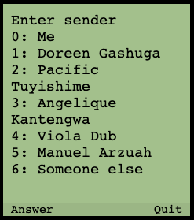
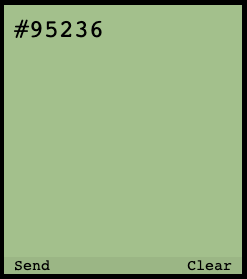

# About USSD Flow mock app

Hi there :), welcome.
This is a simple app designed for technical and non technical users. The objective is to provide a tool to wire USSD flows for visual demos very quickly and without the need to have more than a shallow JavaScript knowledge and/or a keen eye and smart hands . If you're a seasoned engineer you may understand the code flow by reading it without going through the documentation; otherwise take a look at the guide below.

Improvements, cleanup and more details will come time to time.  
A Basic flow is added by default for you to have a "template".

> **note:**
> The sample flow file and the examples here are written in plain old ES5 (with the exception of [template literals](https://developer.mozilla.org/en-US/docs/Web/JavaScript/Reference/Template_literals)) so that anyone with basic JS knowledge can understand it and avoid dealing with the complexity of TDZ, destructuring, spread operator and other ES6+ stuff, but nothing stops you from writing it in ES6+ style if you want.

## See it in action

No dependencies required.

<details>
  <summary>In your local machine</summary>
  <ol>
 <li>Download this repository code in your computer</li>
 <li>Open the <code>/src/index.html</code> file in your preferred browser</li>
 <li>Voilà</li>
 </ol>
</details>

<details>
  <summary>Online demo</summary>
<a href="https://jaxolotl.github.io/ussd-flow-mock/src/index.html" target="_blank">See the demo flow here</a>
</details>

<br/>

> **note:**
> In the first menu only option 1 flow is defined, you can play with the code to add the other ones or change it as you please.

## How to define a flow

- The flow system consists in a combination of simple display functions and arrays.
- There's only one mandatory display `function` named `displayHomeMenu` (see [here](#the-display-functions))
- Each display `function` should return a `render` `function` (see [here](#the-render-function))
- All subsequent display functions are optional and they're part of the flow you'll design

### Learning by doing

Theory tends to be hermetic, let's see the minimum information required and then proceed with some concrete examples based on the sample flow provided on the demo.

#### The display functions

These are the functions of your flow, they are very simple and there's only one mandatory function to define, the `displayHomeMenu`, every other function is up to you and it will depend on the flow you want to design. The rules are simple:

##### Naming convention

I propose to use the prefix "display" (e.g. `displayProducts`, `displayPets`) but it's just an arbitrary convention, you can use whatever name you want (e.g. `doTheListThing`, `x`)

##### Display functions definition

All display functions MUST return the render function. (see [here](#the-render-function) for details)

```javascript
function displayWhatever () {
  return render({
    content: `The whatever content`,
    dataset: theWhateverDataset,
    status: `the status`
  })
}
```

#### The render `function`

The render `function` accepts an object argument to tells the app the following:

- what to show: `content`
- which is the data to control the next move: `dataset`
- which is the display status: `status`

##### `content` property

Any arbitrary string you want to print on the display. No particular limitations with this except for very lengthy strings not being displayed nicely; up to 20 consecutive chars with no spaces are beautifully displayed but it will depend on the viewport size.

##### `dataset` property

Two kind of datasets (Array, Function) are supported and have a specific restriction.

###### `dataset` : `Array` of objects

It must be an array of objects where each object is an item of a list of options and should contain two properties:

- `title`: A `string` with the option text
- `confirm`: a display `function` to be invoked when the option is selected

Each entry of the dataset has an implicit numeric index starting from 0, this index will be used when you select an option number on the "answer/send"  action.  

If you use the `datasetToList` helper (as shown below), it will return a string to be used for the content using the index as prefix for each option item. An empty entry won't be rendered allowing you to define non-consecutive options (e.g. starting from 1 instead of 0, or skipping a number, like 1,2,4,7)

```javascript
const home = [
  null, // empty entry to display a menu starting from 1 instead of 0
  { title: "Request a shipment", confirm: displaySenders }, // an option with a confirm action `displaySenders` defined elsewhere
  { title: "Check shipment status" }, // an option with no confirm action, no-op
  { title: "Repeat recent jobs" }, // no-op
  { title: "Register new user or location" }, // no-op
  { title: "Help / Other services" }, // no-op
]

function displayHomeMenu {
  return render({
    content: `Menu
    ${datasetToList(home)}`,
    dataset: home
  })
}
```

<table>
  <tr>
    <th width="20%"> </th>
    <th width="20%"> Home menu </th>
    <th width="20%"> Answer prompt </th>
    <th width="20%"> Option selection </th>
    <th width="20%"> Sender menu </th>
  </tr>
  <tr>
    <td> status </td>
    <td> `options` </td>
    <td> `answerStandby` </td>
    <td> `answering` </td>
    <td> `options` </td>
  </tr>
  <tr>
    <td> screenshot </td>
    <td></td>
    <td></td>
    <td></td>
    <td></td>
  </tr>
  <tr>
    <td>explanation</td>
    <td>Default home menu is displayed</td>
    <td>User clicked on the "Answer" action and the answer selection page is displayed automatically</td>
    <td>User types the number 1 on the num pad of the UI corresponding to the option 1 of the home menu</td>
    <td>The option 1 has a `confirm` value assigned to the `displaySenders` display function which is invoked and the
      content displayed</td>
  </tr>
</table>

###### `dataset` : `Function` detail

The previous flow is designed when you have a preset of options for the user to select. What if you need arbitrary actions? Let's say instead of having predefined option numbers you want to simulate entering an arbitrary value and whatever value you type the same "page" will be displayed after that.

```javascript
function displayArbitrarySender () {
  return render({
    content: "Enter sender phone number",
    dataset: displayPickupLocations, // note! it's the reference of a function!
    status: 'answerStandby' // see status property explanation
  })
}

function displayPickupLocations () {
  return render({
    content: `Enter pickup location
    ${datasetToList(pickUpLocations)}`,
    dataset: pickUpLocations
  })
}

var pickUpLocations = [
  { title: "Saved location 1", confirm: displayReceivers },
  { title: "Saved location 2", confirm: displayReceivers },
  { title: "Saved location 3", confirm: displayReceivers },
  { title: "Find public location near me", confirm: displayArbitraryPickupLocationCode },
  { title: "Enter a location code", confirm: displayArbitraryPickupLocationCode },
  { title: "MTN branch code", confirm: displayArbitraryPickupLocationCode },
]
```

<table>
  <tr>
    <th width="25%"> </th>
    <th width="25%"> Enter number </th>
    <th width="25%"> Typing number </th>
    <th width="25%"> confirm action invoked </th>
  </tr>
  <tr>
    <td> status </td>
    <td> `answerStandby` </td>
    <td> `answering` </td>
    <td> `options` </td>
  </tr>
  <tr>
    <td> screenshot </td>
    <td></td>
    <td></td>
    <td></td>
  </tr>
  <tr>
    <td>explanation</td>
    <td>Enter sender page is displayed</td>
    <td>User types an arbitrary value and hits "Send"</td>
    <td>The dataset is defined as a function so the `displayPickupLocations` is invoked and the content displayed</td>
  </tr>
</table>

##### `status` property

The status property control how the content will be displayed and which actions are available. There are 3 values available (`options`, `answerStandby`, `final`) for you to use (of course there are more but they are for internal purpose, I wouldn't recommend you to use them)

<table>
  <tr>
    <th width="33%"> `options`</th>
    <th width="33%"> `answerStandby` </th>
    <th width="33%"> `final` </th>
  </tr>
  <tr>
    <td>  </td>
    <td></td>
    <td></td>
  </tr>
  <tr>
    <td>This is the default status if you don't pass along an explicit one, it'll infer you're presenting a list of options each one of them with a numeric value to be selected.</td>
    <td>This is for an arbitrary value to be sent</td>
    <td>This is for a final page, no other actions can be performed except for "Quit" which will take you back to the home page</td>
  </tr>
</table>

## Writing your own flow

You can replace the `sample_flow.js` file referent in the [index.html](src/index.html) at line 75 ( see the `<!-- REPLACE THE SAMPLE FLOW FILE WITH YOURS-->` comment) with another file, OR you can edit the [sample_flow.js](src/assets/sample_flow.js) file with your own code, is up to you.

## Show me some action please!

[See it in action here](https://jaxolotl.github.io/ussd-flow-mock/src/index.html)

PS. If something's not working or you have any suggestion, please go to the repo and file an issue so I can track it. Thanks in advance.
